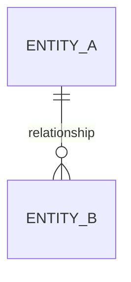
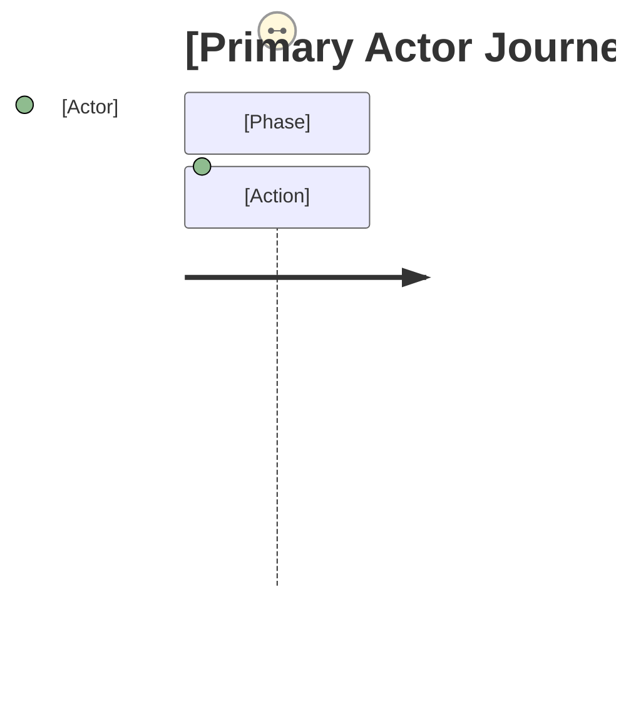

# Architecture & Software Specification

## 1. Architecture Decision Records (ADRs)
*Document the fundamental 'Why' behind core architectural choices.*

### ADR-001: Tenant Strategy
- **Decision**: [Row-level isolation | Schema-per-tenant | Database-per-tenant]
- **Context**: [Target audience scale, e.g., High-density SaaS vs Enterprise]
- **Trade-offs**: [Cost vs. Isolation vs. Compliance]

### ADR-002: Event Delivery Guarantee
- **Decision**: [e.g., Outbox Pattern + At-least-once delivery]
- **Context**: [Need for distributed data consistency without 2PC]

## 2. Domain Context, Tenant Strategy & Provisioning
- **Bounded Context**: [Define the exact context boundary]
- **System Type**: [e.g., API Gateway, Stateful Worker, Core Backend]
- **Tenant Provisioning**: [New tenant creation MUST define steps: e.g., create isolated DB/Schema, run automated migrations, register in Control Plane]
- **Tenant Lifecycle**: [Define state transitions for a tenant: Create, Suspend, Delete/Offboard]

## 3. Identity & Access Management (IAM)
- **Identity Provider (IdP)**: [MUST integrate with Keycloak, Auth0, Cognito, or similar]
- **Protocol**: [MUST use OAuth2 / OIDC]
- **MFA Strategy**: [REQUIRED for privileged roles or sensitive actions]
- **Session & Token Management**: 
  - Token Type: [e.g., Short-lived JWT + HttpOnly Refresh Token]
  - Revocation Strategy: [e.g., Token blocklisting via Redis / Introspection]
- **RBAC Matrix**:
| Role | Resource / Domain | Permissions (C, R, U, D, Execute) | Scoped to Tenant? |
|------|-------------------|-----------------------------------|-------------------|
|      |                   |                                   |                   |

## 4. Security, Key Management (KMS) & Disaster Recovery
- **Key Management**: [MUST use external KMS like AWS KMS, GCP KMS, Vault]
- **Key Lifecycle & Segregation**: [Keys MUST be versioned, rotated every 90 days, and tenant-scoped or logically isolated]
- **Backup & Disaster Recovery (BDR)**: 
  - **Backups**: [Automated backups per tenant DB]
  - **Recovery**: [Point-in-time recovery (PITR) REQUIRED]
  - **RTO/RPO**: [Define explicit Recovery Time Objective and Recovery Point Objective]

## 5. Data Model & Concurrency
### Entity-Relationship Diagram (ERD)

### Concurrency & Consistency
| Entity | Operation | Strategy (Pessimistic / Optimistic Lock) | Rationale |
|--------|-----------|------------------------------------------|-----------|
|        |           |                                          |           |

## 6. Event Model, Integrations & Messaging Isolation
- **Messaging Isolation**: [Topics/queues MUST be tenant-aware OR logically segregated. Cross-tenant message leakage MUST be impossible]
- **Delivery Guarantee**: [Mandatory Outbox Pattern for domain events]
- **Event Registry**:
| Event Name | Producer | Consumer(s) | Payload Structure | Idempotency Key |
|------------|----------|-------------|-------------------|-----------------|
|            |          |             |                   |                 |
## 7. Invariants & Property-Based Testing (PBT)
*Define the deterministic properties that must hold true for formal validation.*

### 7.1 Entity Invariants
| Entity | Property (Invariant) | Description |
|--------|----------------------|-------------|
|        |                      |             |

### 7.2 Workflow & State Invariants
- **[Workflow Name]**: [e.g., An 'Approved' document can never return to 'Draft' state]
- **[Constraint]**: [e.g., Total sum of items must always match the Order total]

### 7.3 Generator Constraints (Testing Data)
| Field | Type | Range / Regex / Constraint | PBT Goal |
|-------|------|---------------------------|----------|
|       |      |                           |          |

## 8. Functional Requirements & Core Journeys

