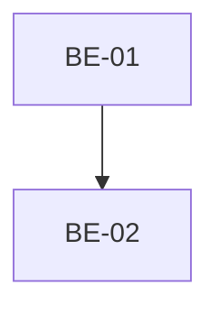

# Execution Backlog: [Feature Name]

## 1. Traceability Context
- **Source SPEC**: `./.spec/[feature]/SPEC.md`
- **Source PLAN**: `./.plan/[feature]/PLAN.md`
- **Goal**: Translate atomic tasks into TDD-driven, physically mapped execution tickets with full execution metadata.

## 2. Sprint Summary
| Phase | Task ID | Type | Priority | Risk | Complexity | Status |
|-------|---------|------|----------|------|------------|--------|
| Phase 1 | `[ID]` | `[Type]` | `[P0/P1/P2]` | `[Low/Med/High]` | `[Points]` | Todo |

## 3. Dependency Graph

---

## 4. Task Backlog

### Task `[Task ID]`: `[Action/Title]`
*Mapped directly from PLAN.md*

- **Constraint Ref**: `[From PLAN]`
- **Depends on (PLAN)**: `[e.g., BE-01, BE-02]`
- **Dependency Type**: `[Hard | Soft]`
- **Layer**: `[From PLAN]`
- **Task Type**: `[Domain | API | Infra | Event | Test]`
- **Priority**: `[P0 | P1 | P2]`
- **Risk Level**: `[Low | Medium | High]`
- **Parallelizable**: `[Yes | No]`
- **Artifact**: `[From PLAN]`
- **Framework Detail**: `[From PLAN]`

#### 📝 Context & Domain Impact
- **Description**: `[Brief explanation of what this task accomplishes.]`
- **Domain Impact**: `[e.g., Affects appointment lifecycle state machine by preventing double booking.]`

#### 🛡️ Technical Enforcement (DO NOT IGNORE)
- **Rule**: `[Constraint Enforcement from PLAN or inferred if weak]`
- **Failure Mode**: `[What breaks if this fails, e.g., Cross-tenant data leakage]`

#### ✅ Acceptance Criteria (BDD)
*Behavior-Driven Development criteria. MUST test Success, Failure, and Edge Cases.*
- **Scenario 1 (Success)**: `[e.g., Successfully extracting tenant]`
  - **Given** `[valid state]`
  - **When** `[action occurs]`
  - **Then** `[expected success outcome]`
- **Scenario 2 (Failure Mode - `[Name]`)**: `[e.g., Missing tenant claim]`
  - **Given** `[invalid state triggering the Failure Mode]`
  - **When** `[action occurs]`
  - **Then** `[system gracefully rejects / throws expected error]`
- **Scenario 3 (Edge Case / Idempotency)**: `[e.g., Duplicate request handling]`
  - **Given** `[boundary condition / duplicate key]`
  - **When** `[action occurs]`
  - **Then** `[expected edge case handling]`

#### 🛠️ Implementation Steps (TDD - Test First)
*Micro-tasks MUST be atomic (< 2h), strictly follow framework naming conventions, and map to the exact Layer folder.*
- [ ] `tests/.../[FileName.test.ext]`: `[Type: Unit | Integration | Contract]` Write tests for Scenarios 1, 2, and 3 (TDD FIRST).
- [ ] `src/.../[FileName.ext]`: Implement `[Artifact]` ensuring `[Enforcement]`.

#### 🏁 Definition of Done (DoD)
- [ ] Test file created BEFORE implementation file.
- [ ] Code implemented in the exact layer directory specified.
- [ ] Tests passing and covering the Failure Mode.
- [ ] No TODOs pending.

---
*(Repeat for each Task ID defined in the PLAN.md)*

---

## 5. Coverage Validation
*Audit checklist to ensure the backlog is complete and safe for execution.*
- [ ] All PLAN tasks converted and mapped.
- [ ] All constraints mapped to explicit BDD scenarios.
- [ ] All tasks include failure mode validation.
- [ ] No circular dependencies in the graph.
- [ ] No orphan tasks (all tasks connected in the dependency graph).

## 6. Plan Feedback (Optional)
*Identify any inconsistencies, missing event tasks, or weak enforcement found in the source PLAN.*
- **Identified Issues**:
  - `[e.g., PLAN is missing the Outbox persistence task for event X. Left ungenerated to maintain determinism.]`
  - `[List any other architectural gaps or contradictory constraints found in the PLAN]`
