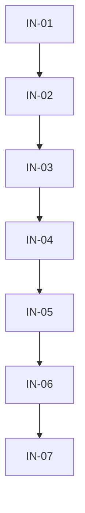

# Execution Backlog — harness-installer

## 1. Traceability Context
- **Source SPEC**: `.spec/governance/harness-installer/SPEC.md`
- **Source PLAN**: `.spec/governance/harness-installer/PLAN.md`
- **Goal**: instalador TDD-ready, fixtures antes/depois, dogfood em cópia.

## 2. Sprint Summary
| Phase | Task ID | Type | Priority | Risk | Status |
|---|---|---|---|---|---|
| Phase 1 | IN-01 | Infra | P0 | High | Done |
| Phase 1 | IN-02 | Interface | P0 | Med | Done |
| Phase 1 | IN-03 | Infra | P0 | Med | Done |
| Phase 2 | IN-04 | Infra | P0 | High | Done |
| Phase 3 | IN-05 | Test | P0 | Med | Done |
| Phase 4 | IN-06 | Test | P0 | Med | Done |
| Phase 4 | IN-07 | Test | P0 | High | Done |

## 3. Dependency Graph

---

## 4. Task Backlog

### Task IN-01: Pre-flight + inventário + backup
- **Constraint Ref**: ADR-003/I1 · **Depends on**: None (Hard) · **Layer**: Infra
- **Task Type**: Infra · **Priority**: P0 · **Risk**: High · **Parallelizable**: No
- **Artifact**: `installer/install.mjs` (pre-flight, inventory, backup)
- #### Contexto — nada existe sem base segura: Node mínimo, sem root, alvo resolvido, backup primeiro.
- #### Enforcement — recusa uid 0 sem `--allow-root` (Y2); pin Node mínimo (G1);
  `--target` com prefix-check (R1); backup verificado antes de tudo (I1);
  manifesto existente/alheio ⇒ aborta (G3/R9).
- #### Acceptance (BDD)
  - **S1 Sucesso**: Given destino válido; When pre-flight+inventário+backup; Then backup existe e verificado.
  - **S2 Falha**: Given uid 0 sem flag / Node abaixo do mínimo / `..` no target; When executa; Then aborta com motivo antes de qualquer escrita.
  - **S3 Borda**: Given manifesto pré-existente (alheio ou re-instalação); When executa; Then aborta com instrução.
- #### Implementation (TDD)
  - [x] `installer/__tests__/preflight.spec.mjs`: S1/S2/S3 antes.
  - [x] Implementar pre-flight + inventário + backup.
- #### DoD — S1/S2/S3 verdes; zero writes fora do target em todos os testes.

### Task IN-02: Q&A com validação
- **Constraint Ref**: ADR-005/I5 · **Depends on**: IN-01 (Hard) · **Layer**: Interface
- **Task Type**: Interface · **Priority**: P0 · **Risk**: Med · **Parallelizable**: No
- **Artifact**: Q&A + validadores por resposta
- #### Enforcement — path existe, comando resolve, stack declarada; campo secret só em memória.
- #### Acceptance
  - **S1**: Given respostas válidas; When Q&A; Then answers completos e validados.
  - **S2**: Given path inexistente / comando que não resolve; When responde; Then rejeita e repete.
  - **S3**: Given campo secret; When serializa answers; Then ausente de todo artefato/log.
- #### Implementation
  - [x] Teste com Q&A fake (respostas scriptadas) antes.
  - [x] Implementar prompts + validadores + marcação secret.
- #### DoD — S1/S2/S3 verdes; nenhum segredo em disco.

### Task IN-03: Geração do config (única fonte)
- **Constraint Ref**: ADR-002/I3 · **Depends on**: IN-02 (Hard) · **Layer**: Infra
- **Task Type**: Infra · **Priority**: P0 · **Risk**: Med · **Parallelizable**: No
- **Artifact**: `generateConfig(answers)`
- #### Enforcement — sem caminho de cópia no código; diff-vs-template em teste.
- #### Acceptance
  - **S1**: Given answers válidos; When gera; Then config válido contra uso (chaves do SPEC §5.1).
  - **S2**: Given destino sem backend Java; When gera; Then `commands` sem chaves Maven + N/A justificado.
  - **S3**: Given tentativa de copiar template; When inspeciona código; Then não existe função de cópia (grep).
- #### Implementation
  - [x] Teste diff-vs-template antes.
  - [x] Implementar gerador puro (sem I/O dentro).
- #### DoD — S1/S2/S3 verdes; gerador puro e determinístico.

### Task IN-04: Merge por camada + manifesto
- **Constraint Ref**: §5.2/I6 · **Depends on**: IN-03 (Hard) · **Layer**: Infra
- **Task Type**: Infra · **Priority**: P0 · **Risk**: High · **Parallelizable**: No
- **Artifact**: merge + `.harness-install.json` (+ campos Y1)
- #### Enforcement — tabela §5.2 linha a linha; detectores normalizados (R4);
  whitespace-normalized (G2); corrompido-aborta (R1); flagged registra (I6).
- #### Acceptance
  - **S1**: Given destino novo; When merge; Then tudo instalado + manifesto completo.
  - **S2**: Given `opencode.json` inválido / colisão real; When merge; Then aborta / flag com motivo.
  - **S3**: Given `agents/*` com seção ausente (variações de whitespace); When merge; Then casa normalizado / flag correto.
- #### Implementation
  - [x] Fixtures por linha da tabela + testes negativos antes.
  - [x] Implementar merge + manifesto (+ hashes Y1).
- #### DoD — S1/S2/S3 verdes; manifesto schema-conformant.

### Task IN-05: Checks + skill de uso
- **Constraint Ref**: RF-07/I6 · **Depends on**: IN-04 (Hard) · **Layer**: Test/Interface
- **Task Type**: Test · **Priority**: P0 · **Risk**: Med · **Parallelizable**: No
- **Artifact**: checks + `.agents/skills/harness-installer/SKILL.md`
- #### Enforcement — flagged⇒FAIL; zero-literais em copiados + canário (R3);
  retenção/descarte do backup documentada (Y3).
- #### Acceptance
  - **S1**: Given instalação limpa; When checks; Then PASS com veredito.
  - **S2**: Given flagged pendente / literal-canário plantado; When checks; Then FAIL com motivo.
  - **S3**: Given skill lida; When segue; Then instala sem ler o SPEC (skill auto-suficiente).
- #### Implementation
  - [x] Canário + flagged-FAIL antes.
  - [x] Implementar checks + SKILL.
- #### DoD — S1/S2/S3 verdes; denylist publicada no teste.

### Task IN-06: Suite de fixtures
- **Constraint Ref**: SPEC §9 · **Depends on**: IN-05 (Hard) · **Layer**: Test
- **Task Type**: Test · **Priority**: P0 · **Risk**: Med · **Parallelizable**: No
- **Artifact**: `installer/__tests__/`
- #### Enforcement — I1..I6 com 2 ramos; leak por campo secret (Y5); `--dry-run` com FS fake.
- #### Acceptance
  - **S1**: Destinos novo/com-conflitos/limpo/corrompido/re-instalação passam conforme tabela.
  - **S2**: Segredo falso ausente de manifesto+config+log (por campo).
  - **S3**: `--dry-run` com FS fake: zero writes contados.
- #### Implementation
  - [x] Todos os fixtures antes das correções que pedirem.
- #### DoD — suite verde; cobertura por invariante auditável.

### Task IN-07: Dogfood em cópia atlas-ecm
- **Constraint Ref**: SPEC §12/V3 · **Depends on**: IN-06 (Hard) · **Layer**: Test
- **Task Type**: Test · **Priority**: P0 · **Risk**: High · **Parallelizable**: No
- **Artifact**: evidência em `.spec/governance/harness-installer/harness/`
- #### Enforcement — trava `/tmp` + abort fora (Y4); suite+restart+smoke+literais (aceite).
- #### Acceptance
  - **S1 (instalação)**: cópia em `/tmp` recebe harness com manifesto; fora de `/tmp` sem `--target`+confirmação ⇒ aborta.
  - **S2 (suite)**: suite do harness verde no destino.
  - **S3 (smoke)**: restart + deny PICCO + allow + deny pkill + HITL no destino.
  - **S4 (literais)**: zero referências ao inexistente no destino.
- #### Implementation
  - [x] Script de dogfood reproduzível (copia, instala, verifica, limpa).
- #### DoD — S1/S2/S3/S4 verdes com evidência arquivada; cópia removida após.

---

## 5. Coverage Validation
- [x] Todas as 7 tasks do PLAN convertidas (IN-01..IN-07, 1:1).
- [x] Y2/G1 → IN-01; Y4 → IN-07; Y5 → IN-06; Y3 → IN-05/06; G2 → IN-04; G3 → IN-01.
- [x] BDD S1/S2/S3 por ticket; TDD-first explícito; DoD por ticket.
- [x] Grafo linear, sem ciclos, sem órfãs.

## 6. Plan Feedback
- `product-manager` pulado com justificativa (mesma do v7: sem superfície de negócio; usuário = PO).
- Microtasks já granulares no formato (passos TDD atômicos por ticket).
