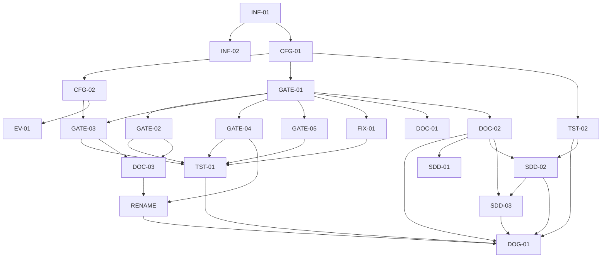

# Execution Backlog — harness-v7-hardening

## 1. Traceability Context
- **Source SPEC**: `.spec/governance/harness-v7/SPEC.md` (v4)
- **Source PLAN**: `.spec/governance/harness-v7/PLAN.md`
- **Runtime Contract**: `.spec/governance/harness-v7/RUNTIME-CONTRACT.md`
- **Goal**: backlog TDD-ready, TDD-first, com DoD por ticket e grafo sem ciclos.

## 2. Sprint Summary
| Phase | Task ID | Type | Priority | Risk | Status |
|---|---|---|---|---|---|
| Phase 0 | INF-01 | Infra | P0 | High | Todo |
| Phase 0 | INF-02 | Infra | P0 | Med | Todo |
| Phase 1 | CFG-01 | Infra | P0 | Med | Done |
| Phase 1 | CFG-02 | Infra | P0 | Med | Done |
| Phase 2 | GATE-01 | Infra | P0 | High | Done |
| Phase 2 | GATE-02 | Infra | P0 | High | Done |
| Phase 2 | GATE-03 | Infra | P0 | High | Done |
| Phase 2 | GATE-04 | Infra | P0 | Med | Done |
| Phase 2 | GATE-05 | Infra | P1 | Med | Done |
| Phase 2 | FIX-01 | Infra | P0 | Med | Done |
| Phase 4 | EV-01 | Doc | P1 | Low | Done |
| Phase 4 | DOC-01 | Doc | P1 | Low | Done |
| Phase 4 | DOC-02 | Doc | P0 | Med | Done |
| Phase 4 | DOC-03 | Doc | P1 | Low | Done |
| Phase 3+5 | TST-01 | Test | P0 | High | Done |
| Phase 3+5 | TST-02 | Test | P0 | Med | Done |
| Phase 5 | DOG-01 | Test | P0 | High | Done |
| Phase 4 | SDD-01 | Doc | P1 | Low | Done |
| Phase 4 | SDD-02 | Test | P1 | Med | Done |
| Phase 4 | SDD-03 | Doc | P1 | Med | Done |
| Phase 4 | RENAME | Infra | P1 | Med | Done |

## 3. Dependency Graph

---

## 4. Task Backlog

### Task INF-01: `git init` + remote + CI de integridade (passo 0)
- **Constraint Ref**: ADR-007/ADR-010 · **Depends on**: None (Hard) · **Layer**: Infra
- **Task Type**: Infra · **Priority**: P0 · **Risk**: High · **Parallelizable**: No
- **Artifact**: `.git`, remote, `.github/workflows/harness-integrity.yml`, `.githooks/pre-commit`
- #### Contexto
  Sem git, ADR-007 é papel. Este ticket é condição de eficácia de I9.
- #### Enforcement
  Commit tocando path protegido sem trailer `Harness-Gate-Change: <aprovador>` ⇒ CI falha.
- #### Acceptance (BDD)
  - **S1 Sucesso**: Given repo com remote; When commit com trailer em path protegido; Then CI passa.
  - **S2 Falha**: Given commit sem trailer em `.opencode/plugins/gate.js`; When CI roda; Then falha com motivo.
  - **S3 Borda**: Given `.githooks` não instalado; When dev commita local; Then pre-commit ausente não bloqueia, CI bloqueia.
- #### Implementation (TDD)
  - [ ] `.github/workflows/harness-integrity.yml`: validar trailer por path alterado.
  - [ ] `.githooks/pre-commit`: espelhar a checagem local.
  - [ ] Commit negativo de teste (sem trailer) ⇒ CI vermelho; depois revert.
- #### DoD
  - [ ] `git remote -v` configurado; CI verde no commit limpo e vermelho no commit sem trailer.

### Task INF-02: Pre-commit local
- **Constraint Ref**: ADR-007 · **Depends on**: INF-01 (Hard) · **Layer**: Infra
- **Task Type**: Infra · **Priority**: P0 · **Risk**: Med · **Parallelizable**: No
- **Artifact**: `.githooks/pre-commit` + `git config core.hooksPath`
- #### Acceptance
  - **S1**: Given hooksPath configurado; When commit sem trailer em path protegido; Then bloqueado local com mensagem.
  - **S2**: Given commit fora de path protegido; When commita; Then passa.
- #### Implementation
  - [ ] Teste: script de checagem com fixture de diff (antes do hook real).
  - [ ] Hook + `core.hooksPath`.
- #### DoD
  - [ ] Bloqueio local demonstrado; CI continua como rede final.

### Task CFG-01: `harness.config.json` + doc do schema
- **Constraint Ref**: RF-01/RF-02 · **Depends on**: INF-01 (Hard) · **Layer**: Infra
- **Task Type**: Infra · **Priority**: P0 · **Risk**: Med · **Parallelizable**: No
- **Artifact**: `harness.config.json`, `.agents/rules/harness-config.md`
- #### Acceptance
  - **S1**: Given config válido; When gate resolve comando canônico; Then usa o valor do config.
  - **S2**: Given config ausente; When qualquer gate roda; Then fail-closed com mensagem (não crash).
  - **S3**: Given `gates.*` desligado no config; When gate avalia; Then **não** desliga (só env desliga — ADR-009).
- #### Implementation
  - [x] Teste: loader com config válido/ausente/inválido.
  - [x] `harness.config.json` + doc.
- #### DoD
  - [x] Zero literal de projeto em `.agents/` e plugins apontando para fora do config (V3 parcial aqui, total em TST-02).

### Task CFG-02: `harness-report.schema.json` + selo de comando
- **Constraint Ref**: ADR-002 · **Depends on**: CFG-01 (Hard) · **Layer**: Infra
- **Task Type**: Infra · **Priority**: P0 · **Risk**: Med · **Parallelizable**: No
- **Artifact**: `.agents/schemas/harness-report.schema.json`
- #### Acceptance
  - **S1**: Given REPORT válido; When validado; Then passa.
  - **S2**: Given REPORT sem `counts` ou sem `selfReported`; When validado; Then falha.
  - **S3**: Given comando do config adulterado; When selo comparado; Then `sealed-command-mismatch`.
- #### Implementation
  - [x] Teste: REPORT válido/inválido + selo confere/diverge.
  - [x] Schema + função de selo (`sha256`) no `gate.js`.
- #### DoD
  - [x] Schema versionado; selo cobre todos os comandos canônicos.

### Task GATE-01: núcleo do `gate.js`
- **Constraint Ref**: ADR-001/006/009 · **Depends on**: CFG-01 (Hard) · **Layer**: Infra
- **Task Type**: Infra · **Priority**: P0 · **Risk**: High · **Parallelizable**: No
- **Artifact**: `.opencode/plugins/gate.js` (DenyError, dispatcher, modos, kill-switch)
- #### Acceptance
  - **S1**: Given `DenyError` lançado; When hook executa; Then tool negada com motivo.
  - **S2**: Given `Error` comum lançado; When hook executa; Then allow + log error (ADR-006).
  - **S3**: Given `HARNESS_GATES=off`; When qualquer gate; Then desligado (e config não desliga).
- #### Implementation
  - [x] Testes `deny-throws` / `plugin-throws` antes da implementação.
  - [x] `gate.js` com dispatcher por tool + `ctx {mode, config, sessionAgent}`.
- #### DoD
  - [x] Contrato: nenhum gate lança `Error` cru (grep).

### Task GATE-02: gate PICCO
- **Constraint Ref**: ADR-004 · **Depends on**: GATE-01 (Hard) · **Layer**: Infra
- **Task Type**: Infra · **Priority**: P0 · **Risk**: High · **Parallelizable**: No
- **Artifact**: gate PICCO em `gate.js`
- #### Acceptance
  - **S1**: Given bloco com tag vazia; When `task`; Then allow.
  - **S2**: Given tag ausente **ou** com conteúdo; When `task`; Then deny (E1/E2).
  - **S3**: Given E3 ausente mas tag vazia; When `task`; Then allow + aviso registrado.
- #### Implementation
  - [x] Fixtures `picco-tag-absent/nonempty/empty`, `picco-e3-missing-tag-present` antes.
  - [x] Parser da tag + integração no dispatcher `task`.
- #### DoD
  - [x] Fixture com a forma real de delegação deste repo passa (anti-falso-positivo).

### Task GATE-03: gate de conclusão (âncoras A+B + contraprova)
- **Constraint Ref**: ADR-002/ADR-008 · **Depends on**: GATE-01, CFG-02 (Hard) · **Layer**: Infra
- **Task Type**: Infra · **Priority**: P0 · **Risk**: High · **Parallelizable**: No
- **Artifact**: âncora A (path-check) + âncora B (state anterior) + re-execução selada
- #### Acceptance
  - **S1**: Given write de `Completed` sem REPORT; When interceptado; Then deny.
  - **S2**: Given REPORT com 0 falhas mas re-execução com >0; When comparado; Then deny.
  - **S3**: Given orquestrador grava fora da allowlist; When interceptado; Then deny.
  - **S4 (borda)**: Given re-execução estoura timeout; When avaliado; Then deny `contraprove-timeout`.
- #### Implementation
  - [x] Fixtures `completed-no-evidence/divergent-counts/ok`, selo, timeout, allowlist antes.
  - [x] Âncora A (args estruturados + `apply_patch`), âncora B (state anterior), re-execução com cache.
- #### DoD
  - [x] Cache `(demand, reportHash, treeHash)` documentado; timeout configurável.

### Task GATE-04: pausa HITL + exceção do loop
- **Constraint Ref**: I6 · **Depends on**: GATE-01 (Hard) · **Layer**: Infra
- **Task Type**: Infra · **Priority**: P0 · **Risk**: Med · **Parallelizable**: No
- **Artifact**: `hitl-guardrail.js` bloqueante
- #### Acceptance
  - **S1**: Given `developer→reviewer` imediatos (2 calls); When avaliado; Then allow (loop).
  - **S2**: Given 3º `task` sem turno humano; When avaliado; Then deny.
  - **S3**: Given turno humano entre tasks; When avaliado; Then allow.
- #### Implementation
  - [x] Fixtures `correction-loop-exempt`, `batch-chained-3rd-task` antes.
  - [x] Contador de `task` por turno + detecção via `chat.message`.
- #### DoD
  - [x] Fluxo obrigatório nunca bloqueado (loop passa sempre).

### Task GATE-05: higiene (`pkill -f`, path parse, escopo qa)
- **Constraint Ref**: I7/I9/RF-06 · **Depends on**: GATE-01 (Hard) · **Layer**: Infra
- **Task Type**: Infra · **Priority**: P1 · **Risk**: Med · **Parallelizable**: Yes
- **Artifact**: gates de parse + `mcp.required` no config
- #### Acceptance
  - **S1**: Given `bash` com `pkill -f`; When avaliado; Then deny.
  - **S2**: Given `cat > .opencode/plugins/gate.js`; When avaliado; Then deny (parse) — e CI reverte.
  - **S3**: Given `qa-engineer` escreve fora de `harness/`; When avaliado; Then deny.
- #### Implementation
  - [x] Fixtures + fixture negativo de evasão (`bash -c`, `python -c`) — medir, não afirmar.
- #### DoD
  - [x] Evasão medida documentada; o que é evadível está marcado 🟠.

### Task FIX-01: corrigir os 2 plugins atuais
- **Constraint Ref**: contrato §6 (G14/N7) · **Depends on**: GATE-01 (Hard) · **Layer**: Infra
- **Task Type**: Infra · **Priority**: P0 · **Risk**: Med · **Parallelizable**: No
- **Artifact**: `harness-validator.js`, `hitl-guardrail.js`
- #### Acceptance
  - **S1**: Given `output.system`; When transform roda; Then é `string[]` (nunca reatribuição escalar).
  - **S2**: Given handler de evento; When filtra; Then usa evento de bus existente (ou removido).
  - **S3**: Given regra em prosa duplicada; When revisado; Then removida (gate vive no `gate.js`).
- #### Implementation
  - [x] Fixture `transform-shape` + `bus-event-dead-handler` antes.
- #### DoD
  - [x] Zero `output.system = string`; zero filtro de evento inexistente.

### Task EV-01: skill `harness-report`
- **Constraint Ref**: CFG-02 · **Depends on**: CFG-02 (Hard) · **Layer**: Interface
- **Task Type**: Doc · **Priority**: P1 · **Risk**: Low · **Parallelizable**: Yes
- **Artifact**: `.agents/skills/harness-report/SKILL.md`
- #### Acceptance
  - **S1**: Subagente lê a skill e produz REPORT válido contra o schema (S2 de CFG-02 como teste).
- #### Implementation
  - [x] Skill com contrato + exemplo válido/inválido.
- #### DoD
  - [x] Exemplo da skill passa na validação do schema.

### Task DOC-01: regra `gate-contract.md`
- **Constraint Ref**: GATE-01 · **Depends on**: GATE-01 (Hard) · **Layer**: Interface
- **Task Type**: Doc · **Priority**: P1 · **Risk**: Low · **Parallelizable**: Yes
- **Artifact**: `.agents/rules/gate-contract.md`
- #### Acceptance
  - **S1**: Toda linha de gate da regra referencia linha do RUNTIME-CONTRACT ou do SPEC.
- #### DoD
  - [x] Zero gate "órfão" (sem mecanismo citado).

### Task DOC-02: dieta de rules
- **Constraint Ref**: G10/G11 · **Depends on**: GATE-01 (Hard) · **Layer**: Interface
- **Task Type**: Doc · **Priority**: P0 · **Risk**: Med · **Parallelizable**: No
- **Artifact**: `workflow-rules.md` fundido (+ `harness-continuous.md` removido)
- #### Acceptance
  - **S1**: `wc -l .agents/rules/*.md` ≤ 1705 (V4).
  - **S2**: 0 referências órfãs a `harness-continuous.md` (V12).
  - **S3**: 1 vocabulário canônico de fase + tabela de conversão (G11/V17).
- #### Implementation
  - [x] Mapa de back-refs antes de mover/remover qualquer seção.
- #### DoD
  - [x] Review do `fullstack-code-reviewer` no diff de docs.

### Task DOC-03: AGENT.md dos 4 agentes
- **Constraint Ref**: GATE-02/GATE-03 · **Depends on**: GATE-02, GATE-03 (Hard) · **Layer**: Interface
- **Task Type**: Doc · **Priority**: P1 · **Risk**: Low · **Parallelizable**: Yes
- **Artifact**: orchestrator/developer-engineer/qa-engineer AGENT.md + reviewer PROMPT.md
- #### Acceptance
  - **S1**: `chrome-devtools` + leitura do config presentes onde se roda H3.
  - **S2**: Nenhum AGENT.md promete enforcement que o runtime não tem (regra do contrato).
- #### DoD
  - [x] Grep de promessas órfãs ⇒ 0.

### Task TST-01: suite de fixtures
- **Constraint Ref**: SPEC §7.3 · **Depends on**: GATE-02, GATE-03, GATE-04, GATE-05, FIX-01 (Hard) · **Layer**: Test
- **Task Type**: Test · **Priority**: P0 · **Risk**: High · **Parallelizable**: No
- **Artifact**: `.opencode/plugins/__tests__/gate.spec.mjs`
- #### Acceptance
  - **S1**: 23/23 fixtures com resultado esperado.
  - **S2**: Suite passa em modo `warn` **e** `enforce`.
  - **S3**: Suite passa com shapes de args dos 2 alvos (U8=c).
- #### Implementation
  - [x] Cada fixture = 1 caso (`node --test`), sem MCP/rede.
- #### DoD
  - [x] `node --test` verde; relatório de evasão anexado.

### Task TST-02: checks estáticos
- **Constraint Ref**: CFG-01 · **Depends on**: CFG-01 (Hard) · **Layer**: Test
- **Task Type**: Test · **Priority**: P0 · **Risk**: Med · **Parallelizable**: Yes
- **Artifact**: script de checks (V2/V3/V7/V12/V14)
- #### Acceptance
  - **S1**: `permission.ask` nos plugins ⇒ 0 (V2).
  - **S2**: path hardcoded ⇒ 0 (V3). **S3**: `output.system = ` escalar ⇒ 0 (V7).
- #### DoD
  - [x] Script roda no CI e local com o mesmo resultado.

### Task DOG-01: dogfood do aceite
- **Constraint Ref**: SPEC §14 · **Depends on**: TST-01, TST-02, DOC-02 (Hard) · **Layer**: Test
- **Task Type**: Test · **Priority**: P0 · **Risk**: High · **Parallelizable**: No
- **Artifact**: evidência em `.spec/governance/harness-v7/harness/`
- #### Acceptance
  - **S1 (V5)**: write de `Completed` sem evidência/consistente-divergente ⇒ deny com motivo acionável.
  - **S2 (V11)**: tentativa por `bash` em path protegido ⇒ deny + revert do CI.
  - **S3**: cenário espelho com evidência correta ⇒ allow (sem falso positivo).
  - **S4**: suite do consumidor usado no teste permanece 0 falhas (regressão).
- #### DoD
  - [x] Critérios 1–4 do §14 verificados e registrados; se qualquer um falhar, o aceite não fecha.

---

### Task SDD-01: Alinhar `sdd-orquestrador/AGENT.md`
- **Constraint Ref**: U10 · **Depends on**: DOC-02 (Hard) · **Layer**: Interface
- **Task Type**: Doc · **Priority**: P1 · **Risk**: Low · **Parallelizable**: Yes
- **Artifact**: `.agents/agents/sdd-orquestrador/AGENT.md`
- #### Contexto — o agente legado referencia rules pré-fusão e opera fora dos gates novos.
- #### Enforcement — cláusula de não-bypass: PICCO e contraprova disparam por tool,
  independentemente do orquestrador; nenhuma promessa de enforcement sem mecanismo.
- #### Acceptance — **S1**: refs resolvem p/ rules fundidas; **S2**: zero promessa órfã;
  **S3**: cláusula explícita de que SDD legado não escapa dos gates.
- #### Implementation — [ ] Ajustar refs; [ ] adicionar cláusula; [ ] grep de refs quebradas.
- #### DoD — refs 0 quebradas; reviewer aprova diff.

### Task SDD-02: Asserts do `sdd-compiler` como checks
- **Constraint Ref**: U10 · **Depends on**: DOC-02 (Hard), TST-02 (Soft) · **Layer**: Test
- **Task Type**: Test · **Priority**: P1 · **Risk**: Med · **Parallelizable**: No
- **Artifact**: checks SDD + wiring no CI
- #### Contexto — spec/plan/tasks/verify/traceability gates hoje são prosa manual.
- #### Enforcement — subconjunto mecânico executável (existência por fase, 1:1 RF→task,
  vocabulário, traceabilidade); dogfood no `.spec` deste repo.
- #### Acceptance — **S1**: `.spec` deste repo passa; **S2**: SPEC quebrada de fixture falha
  com motivo; **S3**: roda no CI e local com mesmo resultado.
- #### Implementation — [ ] Testes dos checks antes; [ ] checks + wiring.
- #### DoD — dogfood verde; CI verde.

### Task SDD-03: Auditabilidade das transições de fase
- **Constraint Ref**: U10 · **Depends on**: DOC-02, SDD-02 (Hard) · **Layer**: Interface
- **Task Type**: Doc · **Priority**: P1 · **Risk**: Med · **Parallelizable**: No
- **Artifact**: convenção `gates:{}` + check artefato↔gate
- #### Contexto — aprovações P0..P6 vivem no chat; sem rastro auditável não há harness.
- #### Enforcement — check (NÃO gate de runtime): PLAN.md exige P1_P2 aprovado registrado;
  TASKS.md exige P2_P3; sem registro ⇒ FAIL do check com motivo.
- #### Acceptance — **S1**: state deste repo passa; **S2**: artefato sem gate registrado falha;
  **S3**: sem deny novo no runtime (grep).
- #### Implementation — [ ] Convenção + check; [ ] dogfood.
- #### DoD — check verde; decisão "sem deny novo" documentada.

### Task RENAME: `fullstack-code-reviewer` → `code-reviewer`
- **Constraint Ref**: U11 · **Depends on**: DOC-03 (Hard), GATE-04 (Soft) · **Layer**: Infra
- **Task Type**: Infra · **Priority**: P1 · **Risk**: Med · **Parallelizable**: No
- **Artifact**: `opencode.json`, dir renomeado, `gate.js:407`, testes, docs/rules
- #### Contexto — blast radius: 45 ocorrências/13 arquivos; `archive/` imutável (fora).
- #### Enforcement — nome antigo em paths vivos ⇒ 0 (check); exceção HITL ainda casa
  (teste com nome novo); suite verde.
- #### Acceptance — **S1**: grep nome antigo (exceto `archive/`) ⇒ 0; **S2**: teste HITL com
  `code-reviewer` passa; **S3**: suite total verde + opencode.json válido.
- #### Implementation — [ ] `git mv` do dir; [ ] chave + path no opencode.json; [ ] match +
  testes no gate; [ ] sweep docs/rules; [ ] check anti-regressão do nome.
- #### DoD — S1+S2+S3 verdes; a partir daqui, delegações usam `code-reviewer`.

## 5. Coverage Validation
- [x] Todas as 22 tasks do PLAN convertidas (17 + SDD-01/02/03 + RENAME, 1:1).
- [x] Sem RFs novos: SDD-* rastreia G10/G11 + §21.2; RENAME rastreia consistência (nomes sem órfãos).
- [x] Constraints mapeadas para BDD (S1/S2/S3 por ticket).
- [x] Failure mode em todo ticket de gate; TDD-first explícito.
- [x] Grafo sem ciclos e sem órfãs (17/17 conectadas).
- [x] DoD por ticket.

## 6. Plan Feedback
- **G11**: vocabulário unificado decidido no SPEC §21.2; DOC-02 executa.
- **N13**: shapes de args instáveis entre alvos → TST-01/S3 exige os 2 alvos (U8=c).
- **N15**: modo "declarou em prosa e parou" não é coberto por runtime — coberto por regra
  de processo (§21.2/U7=a) + âncora B no encadeamento. Declarado, não mascarado.
- **product-manager**: validação de negócio **pulada com justificativa** — refactor de
  governança sem superfície de negócio/usuário; o usuário é o PO e aprovou cada decisão
  de escopo (A, U1–U9). Ratificar no portão P2→P3.
